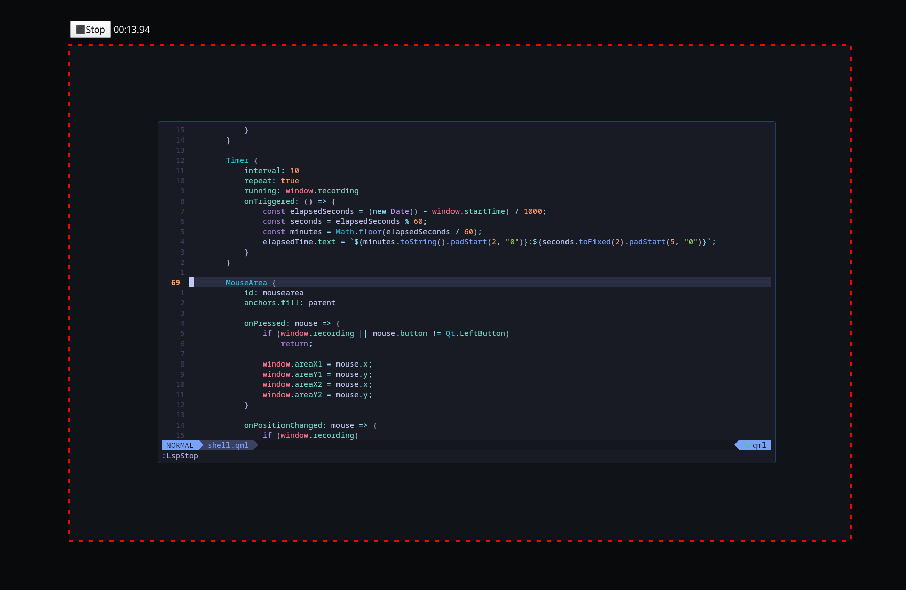

# Wayland screen region recorder using quickshell and wf-recorder

Implements a simple, snipping tool-like screen recorder that lets you select a region.

## Installation

Clone the repo to the quickshell config folder (by default this is in `.config/quickshell`). Also install the following packages:

- wf-recorder
- quickshell

## Usage

First make sure wf-recorder works by running `wf-recorder`. If this produces an error, you might need to install an xdg desktop portal. If it worked fine, follow these steps:

1. Run the recorder with `quickshell -c WaylandRegionRecorder`.
2. You'll be prompted to select the region of the screen you want to record, do this by clicking somewhere on the screen and dragging. You can redo the selection by repeating these steps.
3. If you want to cancel the process, hit escape.
4. Once you're satisfied with the area, hit the "Record" button.
5. When you want to stop the recording, hit the "Stop" button.

The result will be saved to `~/Videos/ScreenRecord/`.

## Credits

- This project is mostly a GUI around [wf-recorder](https://github.com/ammen99/wf-recorder)
